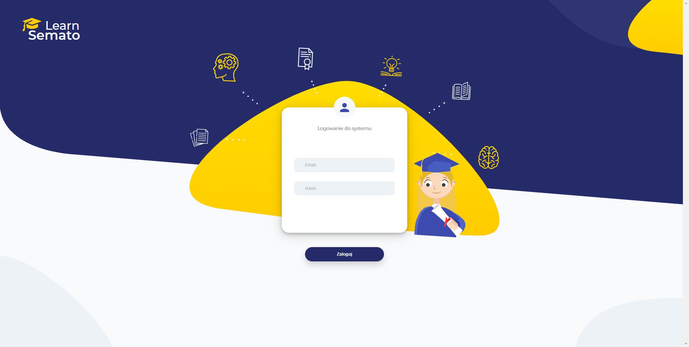
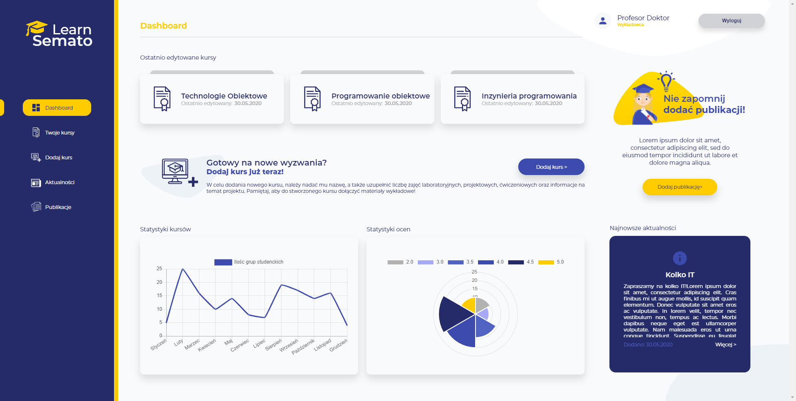
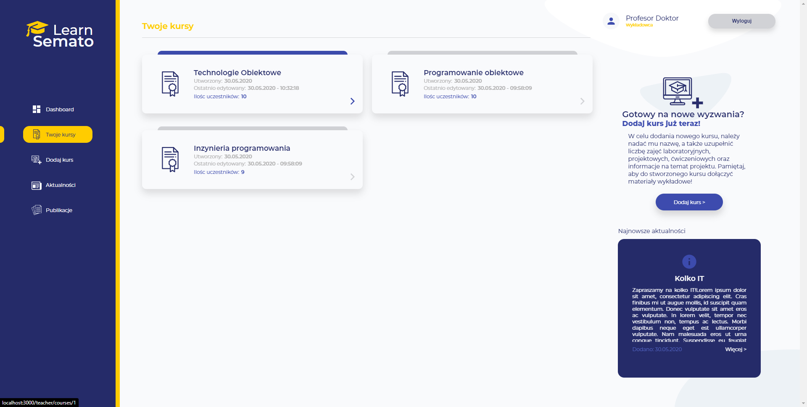
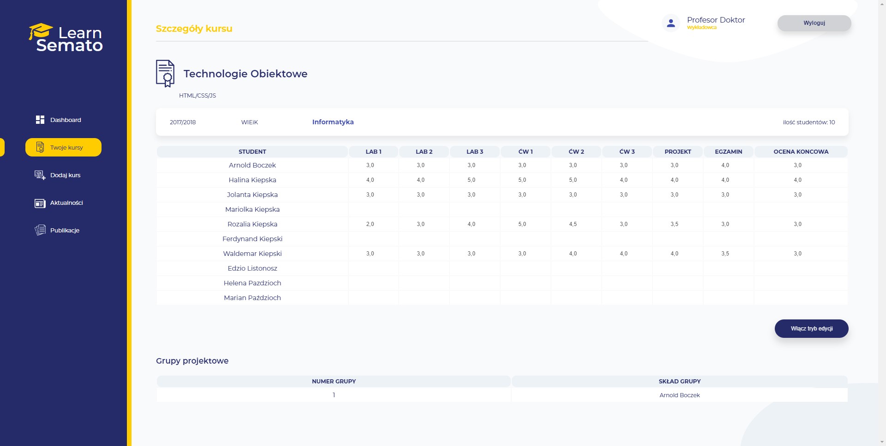
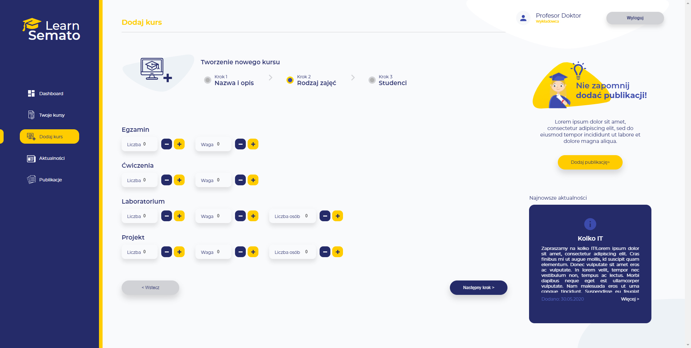

## SEMATO LEARN-UI 

Application created as a university project to improve student-lecturer communication.

This repo includes user interface designed with Adobe Xd and implemented in React.
You can find backend for this app (created by rest of the team) here: [SEMATO LEARN-BACK](https://github.com/semato-project/learn-back).

### SCREENSHOTS

### RUN

In the project directory, you can run:

#### `npm start`

Runs the app in the development mode. 
Open [http://localhost:3000](http://localhost:3000) to view it in the browser.

The page will reload if you make edits. 
You will also see any lint errors in the console.

